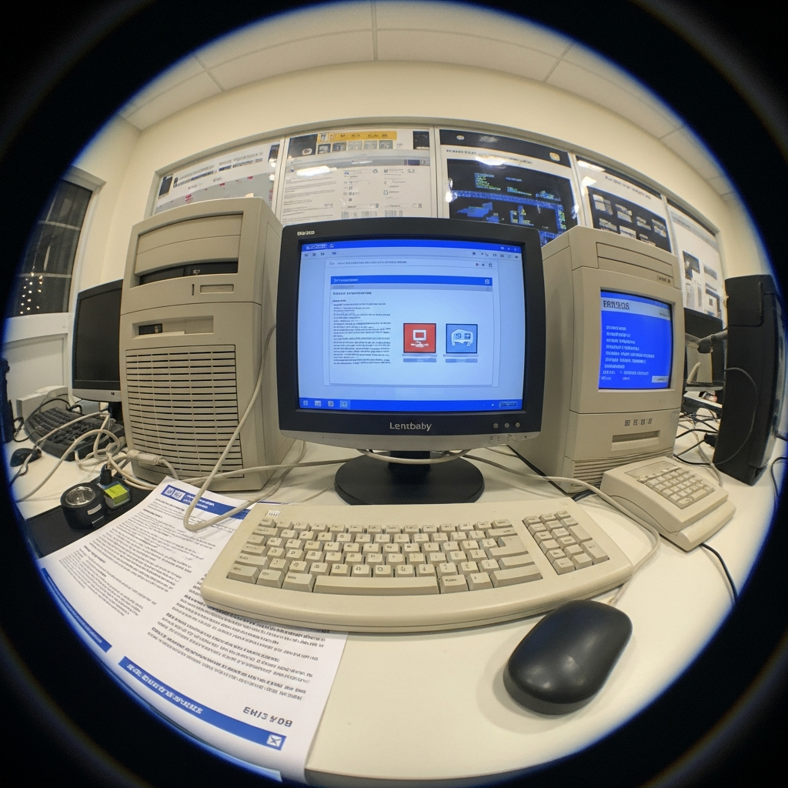

# HW# - EC 0.6 - Reports
### Donnel Garner
### CS 432, Spring 2026
### 02/06/2026

# Q1

*You may copy the question into your report, but make sure that you make it clear where the question ends and your answer begins.*

## Answer

The example figure below shows the growth in the number of websites between 1993 and 1996.



*If you want to include code in your report, you can insert a screenshot (if it's legible), or you can copy/paste the code into a fenced code block.*

```python
#!/usr/local/bin/python3
# testargs.py

import sys

a = "Hello, World!"
print(a.replace("H", "J"))
```

The table below shows a simple table.  

|Week|Date|Topic|
|:---|:---|:---|
|1|Jan 20|Introduction to Web Science and Web Architecture|
|2|Jan 30|Introduction to Python|
|3|Feb 6|Measuring the Web|
|4|Feb 13|Searching the Web|

The table below shows an example confusion matrix (you'll see this term later) from <https://en.wikipedia.org/wiki/Confusion_matrix>.

| | |Actual||
|---|---|---|---|
|**Predicted**| |Cat|Dog|
| |Cat|5 (TP)|3 (FP)|
| |Dog|2 (FN)|3 (TN)|

*You must provide some discussion of every answer. Discuss how you arrived at the answer and the tools you used. Discuss the implications of your answer.*

# Q2

## Answer

# Q3

## Answer

# References

*Every report must list the references that you consulted while completing the assignment. If you consulted a webpage, you must include the URL.  These are just a couple examples.*

* w3Schools, Python Examples, <https://www.w3schools.com/python/python_examples.asp>
* GitHub, public-spr26 repo, <https://github.com/odu-cs432-websci/public-spr26/tree/main>
* Envato App, resources, <https://app.envato.com/>
